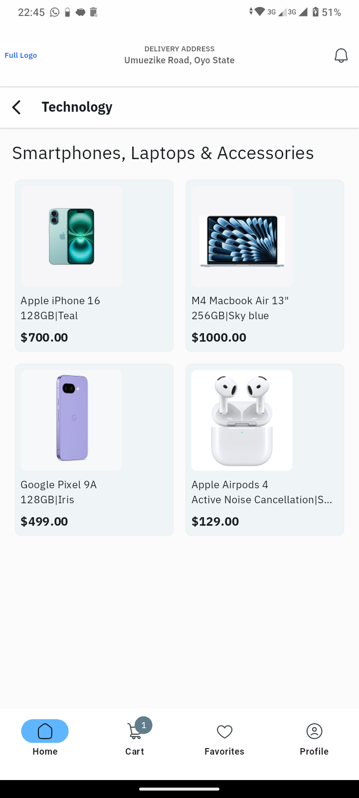
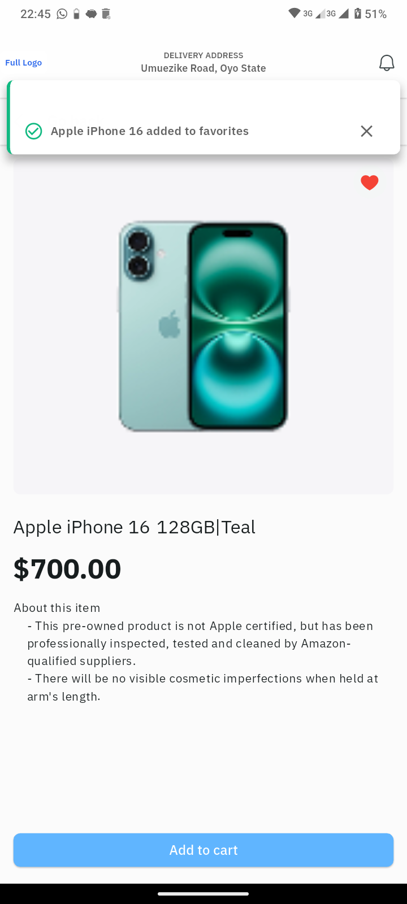
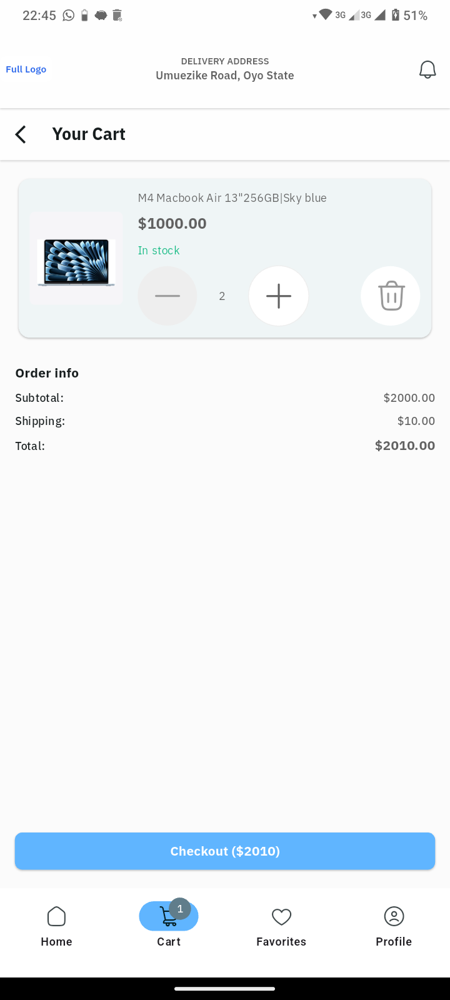

# mini_mart - eCommerce Preview App

## Screenshots

<div style="display: flex; justify-content: space-around; gap: 20px;">
   <div style="text-align: center;">
      <p>Home</p>
      
   </div>
   <div style="text-align: center;">
      <p>Product Detail</p>
      
   </div>
   <div style="text-align: center;">
      <p>Cart</p>
      
   </div>
</div>

AlphaTwelve Mobile App Dev task. A 3-screen e-Commerce preview app  based on provided Figma designs, featuring product browsing, detailed product views, and cart management.

## Features
- **Home Screen**: Product grid with categories
- **Product Details**: Full product information with image
- **Cart Management**: Add/remove items, quantity adjustment
- **State Management**: Riverpod for cart and favorites
- **UI Fidelity**: Pixel-perfect implementation of Figma designs
- **Responsive Design**: Adapts to different screen sizes

## Technical Stack

- **Framework**: Flutter SDK 3.27.2; Dart SDK 3.6.1
- **State Management**: Riverpod 2.6.1
- **Navigation**: Flutter Navigator
- **Fonts**: IBM Plex Sans (primary), Roboto (fallback)
- **Icons**: Material Icons

## Setup Instructions

### Prerequisites
- Flutter SDK (version 3.27.2 or higher)
- Android Studio/VSCode with Flutter plugin
- Dart SDK (included with Flutter)

### Installation
1. Clone the repository:
   ```bash
   git clone https://github.com/Detective-Khalifah/mini_mart.git
   cd minimart
2. Install dependencies:
   ```bash
   flutter pub get
3. Run the app:
   ```bash
   flutter run <platform (optional)>